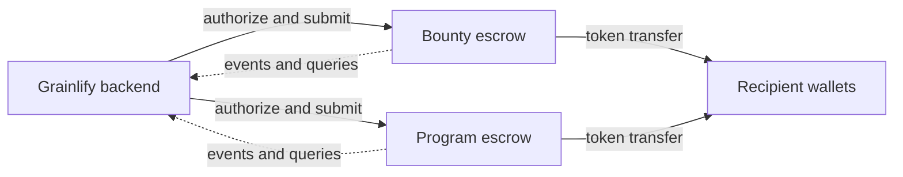

# Grainlify Smart Contract Architecture

Grainlify uses Soroban contracts on Stellar for custody and payout enforcement.
The backend coordinates bounties, programs, verification, and user experience;
the contracts enforce token movement, authorization, deadlines, disputes, and
emergency controls on-chain.

## Contract boundaries

### Bounty escrow

[`EscrowContract`](../bounty_escrow/contracts/escrow/src/lib.rs) manages many
independent bounties in one contract. Each bounty is identified by a `u64` and
stores its depositor, token amount, deadline, status, and payout/refund state.
The contract is initialized once with an admin and token address; calls do not
take a project or program identifier.

The primary interface is:

```text
init(env: Env, admin: Address, token: Address) -> Result<(), Error>
lock_funds(env: Env, depositor: Address, bounty_id: u64, amount: i128, deadline: u64) -> Result<(), Error>
release_funds(env: Env, bounty_id: u64, contributor: Address) -> Result<(), Error>
authorize_claim(env: Env, bounty_id: u64, recipient: Address) -> Result<(), Error>
claim(env: Env, bounty_id: u64) -> Result<(), Error>
refund(env: Env, bounty_id: u64) -> Result<(), Error>
get_escrow_info(env: Env, bounty_id: u64) -> Result<Escrow, Error>
get_balance(env: Env) -> Result<i128, Error>
```

`release_funds` transfers the full remaining balance immediately. The
`authorize_claim`/`claim` pair supports a claim window, while `refund` applies
the deadline and refund-approval rules. Batch operations and query helpers are
also exposed by the same contract; see the [query documentation](QUERY_DOCUMENTATION.md).

### Program escrow

[`ProgramEscrowContract`](../program-escrow/src/lib.rs) manages one program
prize pool per deployed contract instance. `ProgramData` contains the program
identifier, token address, authorized payout key, total funds, remaining
balance, and payout history. Unlike the old design, normal methods do not take
a `program_id` argument because the instance already owns one program.

The current fund and payout interface is:

```text
init_program(env: Env, program_id: String, authorized_payout_key: Address, token_address: Address) -> ProgramData
lock_program_funds(env: Env, from: Address, amount: i128) -> ProgramData
single_payout(env: Env, recipient: Address, amount: i128) -> ProgramData
batch_payout(env: Env, recipients: Vec<Address>, amounts: Vec<i128>) -> ProgramData
get_program_info(env: Env) -> ProgramData
get_remaining_balance(env: Env) -> i128
```

Release schedules and dispute controls are part of the same interface:

```text
create_program_release_schedule(env: Env, amount: i128, release_timestamp: u64, recipient: Address) -> ProgramReleaseSchedule
trigger_program_releases(env: Env) -> u32
open_schedule_dispute(env: Env, schedule_id: u64, reason: String)
resolve_schedule_dispute(env: Env, schedule_id: u64)
cancel_schedule_dispute(env: Env, schedule_id: u64)
```

A schedule dispute must reference an existing schedule. Recipient disputes are
intentionally preemptive and may be opened before a schedule exists for that
recipient. Global, recipient, and schedule disputes are checked before payout
execution. See the [program escrow implementation notes](program-escrow/IMPLEMENTATION_SUMMARY.md) and
[query documentation](QUERY_DOCUMENTATION.md) for the remaining read methods.

## Authorization and safety

- Depositors authorize their own bounty/program funding calls.
- Bounty admin authorization protects release and claim authorization; refunds
  use the contract's deadline and approval rules.
- The program's authorized payout key protects scheduled and direct payouts.
- Admin-only pause, upgrade, configuration, circuit-breaker, and governance
  operations are implemented in the contract source.
- Reentrancy guards, rate limits, fund caps, amount policies, and circuit
  breakers are contract-level controls, not backend assumptions.

The exact event topics and payloads are documented in
[`EVENT_SCHEMA.md`](EVENT_SCHEMA.md). Storage keys and TTL behavior are in
[`STORAGE_AND_TTL.md`](STORAGE_AND_TTL.md), and governance integration is in
[`GOVERNANCE_INTEGRATION.md`](GOVERNANCE_INTEGRATION.md).

## Runtime flow



The backend may submit transactions and index events, but it cannot bypass
contract authorization or change escrow state off-chain. Soroban ledger time is
the source of truth for deadlines, claim windows, scheduled releases, and
proposal expiry.
